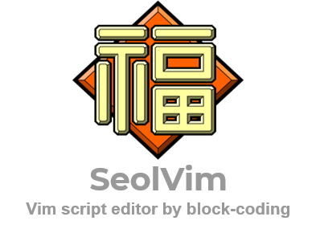
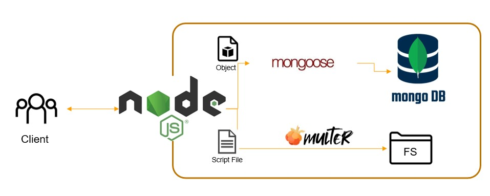

<h1> 2021-2 Capstone Project Back-end (Node.js) </h1>

<h2 align="center"> This repository is for SeolVim Service Backend <h2>

<h2> 사용법 </h2>
<pre>
0. 기본 설정 설치
1. mongoDB 설치 & DB 생성
2. git clone repository_name
3. config.js에 설정 채우기
4. npm install
5. npm start app.js

</pre>

<h2> 기본 설정 설치 (DB, node, ...)</h2>
<pre>
sudo apt-get update && sudo apt-get upgrade     //apt 최신으로
sudo apt-get install npm                        //npm 설치
sudo apt-get install n                          //n 설치

n install stable//node가 최신버전

sudo apt-get install -y mongodb-org
</pre>

<h2> MongoDB 설치</h2>
[도움 될 만한 사이트](https://docs.mongodb.com/manual/tutorial/install-mongodb-on-ubuntu, "google link")</h1>
	- DB "use devSeolvim"
<h2> git clone </h2>
<pre>
git clone <SeolVim Backend 주소>
</pre>

<h2> config 설정 채우기 </h2>
- '#'부분을 채우기
<pre>
module.exports = {
    'secret': '#', <---여기에 secret Key를
    'mongodbUri': 'mongodb://127.0.0.1:27017/devSeolvim',
    'serverPort' : 5000, <--여기에 port를
    'serverName' : "http://127.0.0.1:5000/",
}
</pre>

<h2> npm 모듈 설치 </h2>
<pre>
npm install
</pre>

<h2> 서버 구동 시키기 </h2>
<pre>
npm start app.js
</pre>

<h2> 백엔드 구조 </h2>
<pre>
    
  

</pre>
